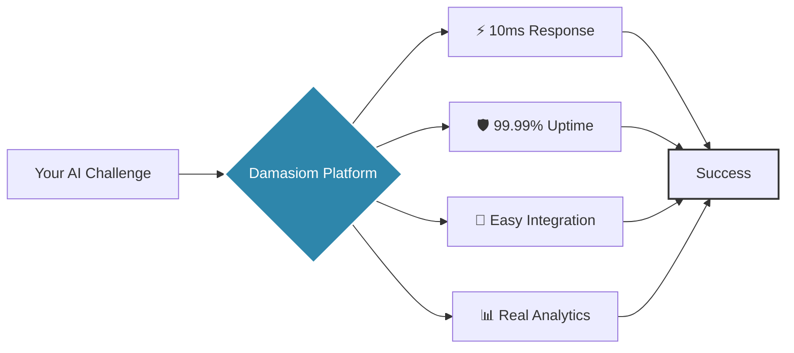

#  Damasiom

  
  
  
  

    <em>Like Damascus steel—forged through countless layers of refinement—we craft AI-powered solutions that combine</em> 
    <strong>⚡ Lightning Speed • 🛡️ Unbreakable Reliability • ✨ Elegant Patterns</strong>
  

  
  
  

---

##  The Art of Digital Damascus

> **Damascus steel** was legendary for its distinctive patterns, incredible sharpness, and unmatched durability. Each blade was unique, yet all shared the same exceptional quality.

At **Damasiom**, we apply this ancient philosophy to modern AI:
- **Multiple Layers** → Multi-model AI orchestration
- **Pattern Welding** → Seamless integration of diverse AI capabilities  
- **Precision Forging** → Optimized for 10ms response times
- **Battle-Tested** → Enterprise-grade reliability

---

## 🚀 Our Flagship Forge

<table>
<tr>
<td width="50%" valign="top">

### ⚡ Super Router

**The Industry's Sharpest Edge**
- 🎯 **10ms routing latency** - Faster than a sword strike
- 🔄 **Intelligent load balancing** across AI providers
- 🛡️ **Automatic failover** for unbreakable uptime
- 📊 **Real-time analytics** and monitoring
- 🔐 **Enterprise security** with end-to-end encryption

</td>
<td width="50%" valign="top">

### 🎨 Playground

**Your Complete AI Workshop**
- 💬 **Chat** with cutting-edge LLMs
- 🖼️ **Image Generation & Editing** 
- 🎵 **Audio Processing** - Transcription, translation, generation
- 🎬 **Video Creation** capabilities
- 🤖 **Agent Orchestration** for complex workflows

</td>
</tr>
</table>

---

## 🔥 Forged with Cutting-Edge Technology

### 🧠 AI/ML Stack

---

## 💡 Core Specializations

<table>
<tr>
<td align="center" width="25%">
 
<strong>AI Gateway</strong> 
10ms routing excellence
</td>
<td align="center" width="25%">
 
<strong>Cloud Infrastructure</strong> 
Scalable & resilient
</td>
<td align="center" width="25%">
 
<strong>AI Agents</strong> 
Autonomous solutions
</td>
<td align="center" width="25%">
 
<strong>ML Operations</strong> 
Production-ready AI
</td>
</tr>
</table>

---

## 🎯 Our Mission

> *"To democratize AI development by providing tools that are as strong as Damascus steel—* 
> *combining unmatched performance, reliability, and elegance to empower developers* 
> *in building the next generation of AI-powered solutions."*

---

## 📈 Why Choose Damasiom?

---

## 🌟 What Sets Us Apart

<b>⚡ Speed Without Compromise</b>

 
Our Super Router achieves 10ms latency not by cutting corners, but by optimizing every layer of the stack—from network protocols to AI model selection.

<b>🔄 True Multi-Model Architecture</b>

 
Seamlessly switch between AI providers and models based on task requirements, cost optimization, or availability—all transparent to your application.

<b>🤖 Agent-First Philosophy</b>

 
Built for the agentic future where AI systems collaborate, delegate, and solve complex problems autonomously.

<b>🏗️ Enterprise-Grade Foundation</b>

 
Every line of code is written with production in mind—scalable, maintainable, and battle-tested.

---

## 📬 Let's Forge Something Together

### Ready to experience the strength of Damascus-grade AI?

 

**Building the future of AI, one layer at a time.**

---

  © 2025 Damasiom. Forged with precision. Built to last.

<!-- 
ASCII Art Alternative (if you prefer):

    ╔══════════════════════════════════════════════════════════════╗
    ║  ____                            _                          ║
    ║ |  _ \  __ _ _ __ ___   __ _ ___(_) ___  _ __ ___           ║
    ║ | | | |/ _` | '_ ` _ \ / _` / __| |/ _ \| '_ ` _ \          ║
    ║ | |_| | (_| | | | | | | (_| \__ \ | (_) | | | | | |         ║
    ║ |____/ \__,_|_| |_| |_|\__,_|___/_|\___/|_| |_| |_|         ║
    ║                                                              ║
    ║           Forging AI Solutions with Damascus Precision       ║
    ╚══════════════════════════════════════════════════════════════╝
-->
